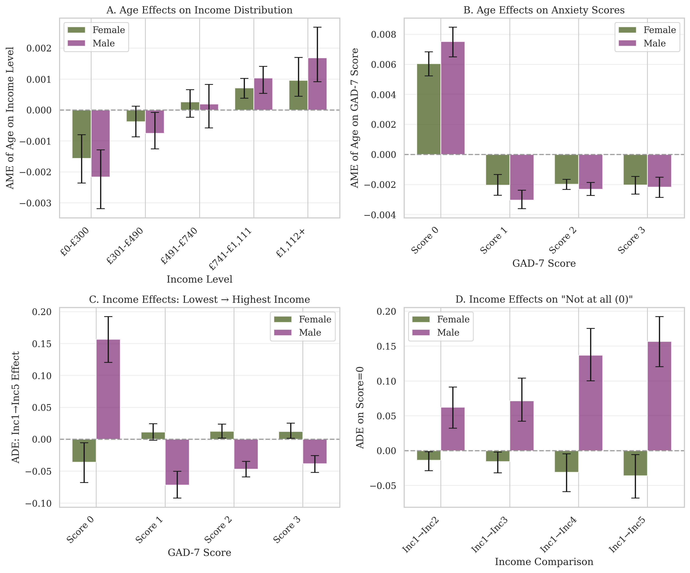

# Bayesian Mediation Analysis with Ordinal Variables from: Exploring the effects of household income on self-reported mental health measures during the COVID-19 pandemic via a Bayesian causal model 

This repository implements a Bayesian mediation model examining whether household income mediates the relationship between age and mental helath symptoms (GAD-7 scores, and PHQ-9 scores), with variation by gender and across questionnaire items. Here we present part of the analysis on anxiety as an example. 

## Model Structure

### Variables
- **Age** (standardized): Predictor variable $X$
- **Income**: Mediator variable $M$ (ordinal with 7 levels)
- **GAD-7 scores**: Outcome variable $Y$ (ordinal with 4 levels: 0-3)
- **Gender**: Stratifying variable
- **Question**: Questionnaire item (allowing for item-specific effects)

### Mathematical Specification

#### Mediator Model (Income ~ Age)
For individual $i$ with gender $g[i]$:

$$\text{Income}_i \sim \text{OrderedLogistic}(\eta_i^M, \kappa^M)$$

$$\eta_i^M = \alpha_{g[i]}^M + a_{g[i]} \cdot \text{Age}_i$$

where:
- $\alpha_g^M$: Gender-specific intercepts
- $a_g$: Gender-specific effect of age on income (path **a**)
- $\kappa^M$: Cutpoints for income categories

#### Outcome Model (GAD-7 ~ Age + Income)
For individual $i$ with gender $g[i]$ and question $q[i]$:

$$\text{GAD-7}_i \sim \text{OrderedLogistic}(\eta_i^Y, \kappa_{q[i]}^Y)$$

$$\eta_i^Y = \alpha_{g[i], q[i]}^Y + c_{g[i], q[i]} \cdot \text{Age}_i + \beta_{g[i], q[i], \text{Income}_i}$$

where:
- $\alpha_{g,q}^Y$: Gender- and question-specific intercepts
- $c_{g,q}$: Direct effect of age on GAD-7 (path **c'**)
- $\beta_{g,q,k}$: Effect of income level $k$ on GAD-7 (path **b**), with monotonic ordering constraint

#### Monotonic Income Effects
Income effects $\beta_{g,q,k}$ are constrained to be monotonic across income levels:

$$\beta_{g,q,1} \leq \beta_{g,q,2} \leq ... \leq \beta_{g,q,7}$$

This is implemented via a cumulative parameterization using a Dirichlet prior on the increments between levels.

#### Mediation Effects
- **Indirect effect**: $IE_{g,q,k} = a_g \times \beta_{g,q,k}$
- **Direct effect**: $c_{g,q}$
- **Total effect**: $TE_{g,q,k} = c_{g,q} + a_g \times \beta_{g,q,k}$

### Priors
All parameters are assigned weakly informative priors, with hierarchical structure for intercepts and slopes using non-centered parameterization:

$$\begin{align*}
\alpha_{g}^M, \alpha_{g,q}^Y, a_g, c_{g,q}, \beta_{g,q,k} &\sim \text{Normal}(\mu_{\text{pooled}}, \sigma_{\text{pooled}}) \\
\mu_{\text{pooled}} &\sim \text{Normal}(0, 1) \\
\sigma_{\text{pooled}} &\sim \text{HalfNormal}(1)
\end{align*}$$

Cutpoints are given ordered Normal priors, and income increments are given a Dirichlet prior.

## Results

The figure shows posterior distributions (means and 90% HDIs) for key model parameters:

- **A**: Effect of age on income distribution (path a). Age has minimal impact on income category, with estimates near zero for both genders.

- **B**: Average marginal effects of age on anxiety scores, averaged across question. 

- **C**: Average discrete effects of income on anxiety scores, averaged across question and showing increase/decrease from lowest to highest income level.

- **D**: Average discrete effects of income on anxiety scores, averaged across question and showing change from lowest to every other income level for score=0. 

## Implementation

The model is implemented in PyMC using:
- `OrderedLogistic` distributions for ordinal outcomes
- Non-centered parameterization for hierarchical effects
- Deterministic calculations of indirect and total effects

Debugging and optimisation of plotting scripts was supported with DeepSeek-V3, the authors reviewed and edited the content for final version.

## Requirements

- Python 3.8+
- PyMC 5.0+
- ArviZ
- Matplotlib
- NumPy/Pandas

## Citation

If you use this code or methodology, please cite this repository.